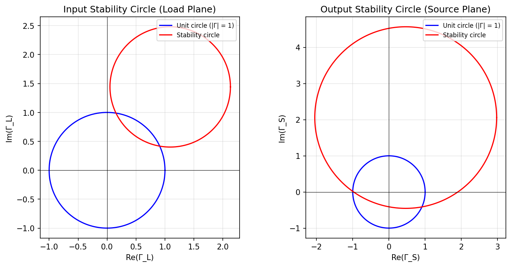

# EECS 182 HW4

## ECE 182 Homework Assignment

Design a MIC single stage amplifier using SMC. Follow the steps below to do your design.

1. Check amplifier stability at the input and output; if the device is not unconditionally stable, draw the stability circles at the input and output.
2. If the device is conditionally stable, add loss at the output to make it unconditionally stable.
3. Compute the new scattering parameters for the device with the resistor added for stability.
4. Calculate maximum stable gain of the new device (original plus resistor).
5. Compute $\Gamma_{ML}$ and $\Gamma_{MS}$ and select the corresponding passive loads.
6. Use the Smith chart to design the input and output matching networks using discrete L, C networks.
7. Design the bias network for the device including the decoupling capacitors.
8. Provide a good draw to scale of the circuit layout.

---

## Device Parameters and Dimensions

*Note: Angles are in degrees and magnitude in linear scale.*

### S-Parameter Table (5.0 GHz)

| freq | magS11 | angS11 | magS21 | angS21 | magS12 | angS12 | magS22 | angS22 |
| ---- | ------ | ------ | ------ | ------ | ------ | ------ | ------ | ------ |
| 5.0  | 0.4    | 23     | 2.0    | 11     | 0.2    | 46     | 0.839  | -66    |

---

### 77 Package

- **Pin configuration (top-down):**
  - **Pin 4:** SOURCE (top)
  - **Pin 1:** GATE (left)
  - **Pin 3:** DRAIN (right)
  - **Pin 2:** SOURCE (bottom)

---

### 402 Passive Device Dimensions (inches)

| Parameter | Value        |
| --------- | ------------ |
| L         | 0.04 ± 0.004 |
| W         | 0.02 ± 0.004 |
| T         | 0.02 ± 0.004 |
| EB        | 0.01 ± 0.006 |

---
*All numerical values are from [problem_calc.py](problem_calc.py).*

## Problem 1: Stability and Stability Circles

### 1.1 Complex S-Parameters

Convert from magnitude and angle (linear scale, degrees) using $S_{ij} = |S_{ij}|\, e^{j\theta_{ij}}$ with angles in radians. At 5.0 GHz:

| Parameter | Rectangular form $a + jb$ |
| --------- | ------------------------- |
| $S_{11}$  | $0.368 + j0.156$          |
| $S_{21}$  | $1.963 + j0.382$          |
| $S_{12}$  | $0.139 + j0.144$          |
| $S_{22}$  | $0.341 - j0.766$          |

### 1.2 Stability Factor $K$

**Definitions** (Rollett):

$$
\Delta = S_{11}S_{22} - S_{12}S_{21}
$$

$$
K = \frac{1 - |S_{11}|^{2} - |S_{22}|^{2} + |\Delta|^{2}}{2\,|S_{12}S_{21}|}
$$

**Numerical values:**
- $\Delta = S_{11}S_{22} - S_{12}S_{21} = 0.0276 - j0.564$
- $|\Delta| = 0.565$
- $K = 0.569$

**Stability criterion (unconditional stability):** $K > 1$ and $|\Delta| < 1$.

Here $K = 0.569 < 1$, so the device is **conditionally stable**. The input and output stability circles must be drawn to identify safe source and load terminations.

### 1.3 Input Stability Circle (Load Plane, $\Gamma_L$)

Locus of $\Gamma_L$ for which $|\Gamma_{\text{in}}| = 1$.

**Center:**

$$
C_L = \frac{(S_{22} - \Delta S_{11}^{\ast})^{\ast}}{|S_{22}|^{2} - |\Delta|^{2}}
$$

**Radius:**

$$
r_L = \frac{|S_{12}S_{21}|}{\left| |S_{22}|^{2} - |\Delta|^{2} \right|}
$$

**Numerical results:**
- $C_L = 1.09 + j1.44$ (or $|C_L| \approx 1.81$, angle $\approx 53^\circ$)
- $r_L = 1.04$

### 1.4 Output Stability Circle (Source Plane, $\Gamma_S$)

Locus of $\Gamma_S$ for which $|\Gamma_{\text{out}}| = 1$.

**Center:**

$$
C_S = \frac{(S_{11} - \Delta S_{22}^{\ast})^{\ast}}{|S_{11}|^{2} - |\Delta|^{2}}
$$

**Radius:**

$$
r_S = \frac{|S_{12}S_{21}|}{\left| |S_{11}|^{2} - |\Delta|^{2} \right|}
$$

**Numerical results:**
- $C_S = 0.463 + j2.06$ (or $|C_S| \approx 2.11$, angle $\approx 77^\circ$)
- $r_S = 2.51$

---

## Problem 2: Output Loss and New S-Parameters

Add loss at the output so the composite two-port is unconditionally stable, then compute its scattering parameters. The loss is modeled as a **shunt resistor** $R$ at the device output (reference $Z_0 = 50\,\Omega$). The composite two-port is: [Device] → [Shunt R] → load.

### 2.1 Minimum loss for stability

Using `problem_calc.py`, I swept the shunt resistance to find the **largest** $R$ (i.e., the **minimum loss**) such that the composite satisfies $K^{\prime} \geq 1$ and $|\Delta^{\prime}| < 1$.

At the stability boundary:

- $R \approx 299.3\,\Omega$ (marginally stable: $K^{\prime} = 1$)
- $K^{\prime} \approx 1.00$
- $|\Delta^{\prime}| \approx 0.476$

I chose a different value for the design: **$R = 50\,\Omega$**, which gives $K^{\prime} > 1$ and makes the composite **unconditionally stable**. All following calculations use $R = 50\,\Omega$.

### 2.2 Output Loss (Shunt Resistor)

With $Z_0 = 50\,\Omega$ and shunt resistance $R$, the two-port S-parameters of the resistor block are:

$$
S_{11}^{(R)} = S_{22}^{(R)} = \frac{-Z_0}{2R + Z_0}, \qquad S_{12}^{(R)} = S_{21}^{(R)} = \frac{2R}{2R + Z_0}
$$

**Choice:** $R = 50\,\Omega$ (chosen for unconditional stability; boundary is $R \approx 299.3\,\Omega$).

**Numerical values:**
- $S_{11}^{(R)} = S_{22}^{(R)} = -\frac{1}{3} \approx -0.333$
- $S_{12}^{(R)} = S_{21}^{(R)} = \frac{2}{3} \approx 0.667$

### 2.3 Cascade via T-Parameters

Device output is connected to resistor input. The cascade is computed using T-parameters: $\mathbf{T}_{\text{cascade}} = \mathbf{T}_{\text{device}} \cdot \mathbf{T}_{\text{resistor}}$, then convert back to S.

**S → T** (for each two-port):

$$
T_{11} = \frac{-\det(\mathbf{S})}{S_{21}}, \quad
T_{12} = \frac{S_{11}}{S_{21}}, \quad
T_{21} = \frac{-S_{22}}{S_{21}}, \quad
T_{22} = \frac{1}{S_{21}}
$$

**T → S** (for composite):

$$
S^{\prime}_{11} = \frac{T_{12}}{T_{22}}, \quad
S^{\prime}_{21} = \frac{1}{T_{22}}, \quad
S^{\prime}_{12} = \frac{\det(\mathbf{T})}{T_{22}}, \quad
S^{\prime}_{22} = \frac{-T_{21}}{T_{22}}, \quad
\det(\mathbf{T}) = T_{11}T_{22} - T_{12}T_{21}
$$

### 2.4 New S-Parameters (Composite: Device + Resistor)

| Parameter | Rectangular form $a + jb$ |
| --------- | ------------------------- |
| $S^{\prime}_{11}$ | $0.328 + j0.047$ |
| $S^{\prime}_{21}$ | $1.07 + j0.473$ |
| $S^{\prime}_{12}$ | $0.060 + j0.100$ |
| $S^{\prime}_{22}$ | $-0.137 - j0.261$ |

### 2.5 Stability Verification

$$
\Delta^{\prime} = S^{\prime}_{11}S^{\prime}_{22} - S^{\prime}_{12}S^{\prime}_{21}, \qquad
K^{\prime} = \frac{1 - |S^{\prime}_{11}|^{2} - |S^{\prime}_{22}|^{2} + |\Delta^{\prime}|^{2}}{2\,|S^{\prime}_{12}S^{\prime}_{21}|}
$$

**Numerical values:**
- $\Delta^{\prime} = -0.050 - j0.227$
- $|\Delta^{\prime}| \approx 0.233$
- $K^{\prime} \approx 3.15$

**Conclusion:** With $R = 50\,\Omega$, $K^{\prime} > 1$ and $|\Delta^{\prime}| < 1$, so the composite is **unconditionally stable**. (The boundary value is $R \approx 299.3\,\Omega$, where $K^{\prime} = 1$.)

---

## Problem 3: Maximum Stable Gain of the Composite Device

For the stabilized device (original plus shunt resistor), the **maximum stable gain** is

$$
G_{\text{MSG}} = \left| \frac{S^{\prime}_{21}}{S^{\prime}_{12}} \right|
$$

Using the composite S-parameters from Problem 2,

- $G_{\text{MSG}} = 10.0$ (linear)
- $G_{\text{MSG}} \approx 20.0\,\text{dB}$

---

## Problem 4: $\Gamma_{\text{ML}}$ and $\Gamma_{\text{MS}}$ (Simultaneous Conjugate Match)

For the unconditionally stable composite device, the simultaneous conjugate match gives the source and load reflection coefficients that maximize transducer gain. Using the composite S-parameters $S'\_\{ij\}$ and $\Delta' = S'\_\{11\}S'\_\{22\} - S'\_\{12\}S'\_\{21\}$:

**Source side (input match):**

$$
B_1 = 1 + |S^{\prime}_{11}|^{2} - |S^{\prime}_{22}|^{2} - |\Delta^{\prime}|^{2}, \qquad
C_1 = S^{\prime}_{11} - \Delta^{\prime}(S^{\prime}_{22})^{\ast}
$$

$$
\Gamma_{\text{MS}} = \frac{B_1 - \sqrt{B_1^{2} - 4|C_1|^{2}}}{2 C_1}
$$

(The minus sign in front of the square root is chosen so that $|\Gamma_{\text{MS}}| < 1$ for a passive source termination.)

**Load side (output match):**

$$
B_2 = 1 + |S^{\prime}_{22}|^{2} - |S^{\prime}_{11}|^{2} - |\Delta^{\prime}|^{2}, \qquad
C_2 = S^{\prime}_{22} - \Delta^{\prime}(S^{\prime}_{11})^{\ast}
$$

$$
\Gamma_{\text{ML}} = \frac{B_2 - \sqrt{B_2^{2} - 4|C_2|^{2}}}{2 C_2}
$$

(The minus sign gives $|\Gamma_{\text{ML}}| < 1$ for a passive load.)

**Numerical values** (from `problem_calc.py`, composite with $R = 50\,\Omega$):

| Quantity | Value | $\lvert \Gamma \rvert$ |
| --- | --- | --- |
| $\Gamma_{\text{MS}}$ | $0.294 - j0.032$ | $0.296$ |
| $\Gamma_{\text{ML}}$ | $-0.127 + j0.217$ | $0.252$ |

Both $|\Gamma_{\text{MS}}|$ and $|\Gamma_{\text{ML}}|$ are less than 1, so the corresponding terminations are **passive** and realizable. I select these as the design values for the input and output matching networks: the source matching network should present $\Gamma_{\text{MS}}$ to the composite device input, and the load matching network should present $\Gamma_{\text{ML}}$ to the composite device output (or equivalently, the load impedance that gives reflection $\Gamma_{\text{ML}}$ when looking into the output port).